# ONE

**Many wallets. One onchain identity.**

### 🔗 [**Try it live → oneidentity.app**](https://oneidentity.app)

**[Open the app](https://oneidentity.app)** · **[See a real Verified ONE](https://oneidentity.app/one/0x1139dec3A681C96807D8C277601655A707494AaA)** · **[Watch-only portfolio](https://oneidentity.app/portfolio)**

Live on **Monad Mainnet** · Registry [`0xf8E6…F915`](https://monadscan.com/address/0xf8E62d8D16acB49eeEeCF13DE48f1f6898c2F915) · Source-verified · 511 automated tests · [MIT](LICENSE)

> No wallet needed to look around. The portfolio and every public ONE profile are read-only.

---

## Overview

ONE gives you two things:

- **A watch-only combined portfolio** for up to five Monad wallets — no connection, no signature, nothing written onchain.
- **A verified public onchain identity** that cryptographically links two to five wallets you control.

Both views combine **MON, supported stablecoins, and ERC-721 NFT collections** across every wallet. A Verified ONE produces a single public address you can share; anyone can open it and see the combined holdings.

Because the identity lives onchain, other applications can query it — a mint, an airdrop, or a token gate can ask "how many of this collection does this *person* hold?" instead of checking one address at a time.

> **The ONE identity address does not hold your assets.**
> It is an identity contract, not a wallet. Every asset stays exactly where it is, in the wallets you already control. ONE never takes custody.

---

## Problem

- Assets end up scattered across hot wallets, cold wallets and hardware wallets.
- Checking a real position means opening several wallets, one at a time.
- NFT holdings fragment across addresses, so no single view shows what you actually own.
- Cold wallets are the most secure and the most inconvenient to monitor — checking one usually means unlocking it.
- Projects evaluate eligibility **one wallet at a time**, so someone holding 2 + 1 + 2 NFTs across three wallets can fail a "hold 5" gate they genuinely satisfy.
- After a compromise, there is no simple way to show that a wallet was yours *before* the incident.
- There is no straightforward way to publish one public identity that represents several wallets.

---

## Solution

**Personal Portfolio** needs nothing from you but public addresses.

- No wallet connection, no signature, no transaction.
- Paste one to five public addresses and ONE reads their current public onchain holdings.
- Nothing is written anywhere.

> **Your cold wallet stays cold. ONE only reads public onchain data.**

**Verified ONE** proves the wallets belong together.

- Every secondary wallet signs an **EIP-712** authorization.
- The primary wallet submits **one atomic transaction**.
- The result is a public identity address anyone can query.
- Assets never move. ONE never controls or custodies funds.

---

## Primary user stories

**Personal Portfolio**

> As a user with assets across hot wallets, cold wallets and hardware wallets, I can save up to five public addresses and monitor their combined MON, stablecoins and NFT collections without connecting or unlocking those wallets.

**Verified ONE**

> As a user controlling several wallets, I can authorize their relationship once and create a public onchain identity that applications and other people can query.

**Proof of prior control**

> As a user whose wallet is later compromised, I can reference an earlier Verified ONE record as cryptographic evidence that the wallet was linked to my other wallets before the incident.

**What that last one is and is not.** A Verified ONE is a timestamped, signed, public record of association. It is **evidence of prior association only**. It does **not** prove current control after a compromise, it does **not** recover stolen funds, and it does **not** reverse transactions. Treat it as provenance, never as a recovery mechanism.

---

## Watch-only portfolio

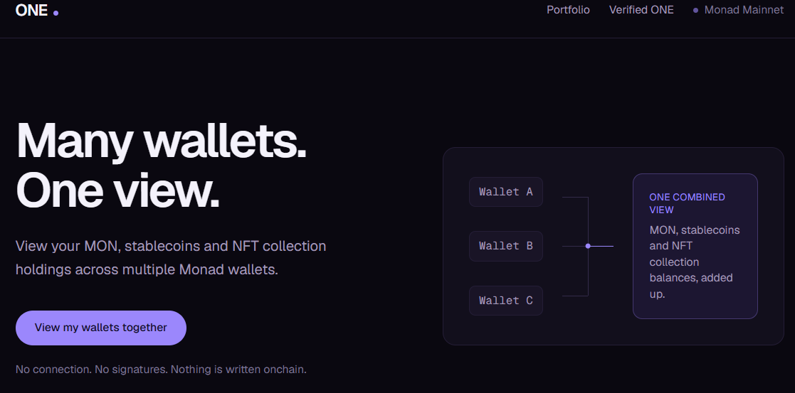

Enter one to five public addresses. The unverified state is labelled plainly and permanently — this mode makes **no** cryptographic claim that the wallets share an owner.

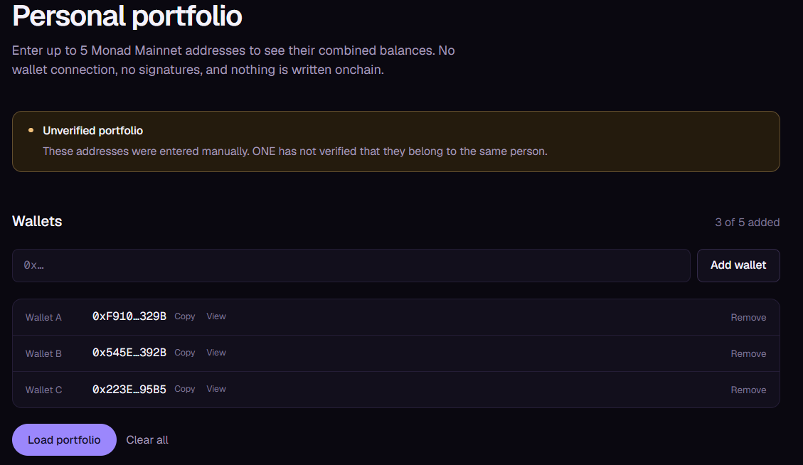

Balances are read at a **single pinned block** and shown combined, with a per-wallet breakdown underneath.

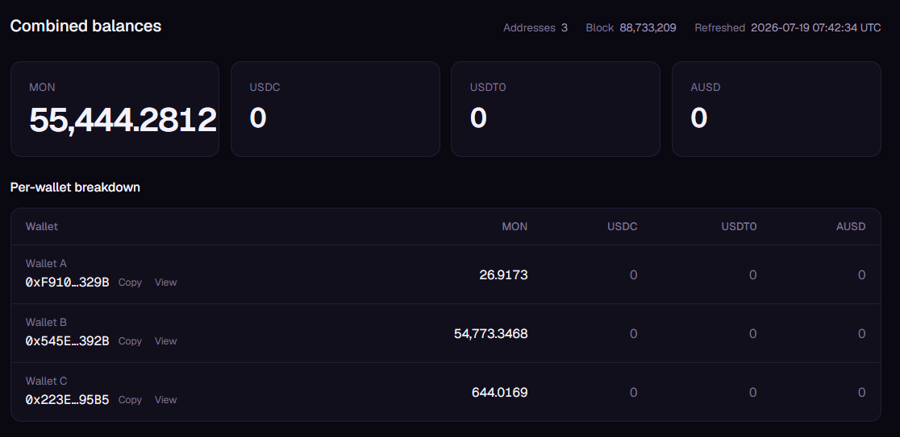

**Your wallet list is saved, your balances are not.** Addresses are kept in
`localStorage` so a return visit does not mean retyping five of them. Balances,
NFT results and block numbers are deliberately never persisted — they go stale
the moment they are written, and a stale balance shown as current is worse than
no balance at all. Everything is re-read from Monad on request.

Nothing loads automatically on arrival. A returning user sees **"Saved portfolio
found"** and an explicit **Load saved portfolio** button, because NFT discovery
scans transfer history and can take several seconds and many RPC calls — opening
a page should not silently start that work. After a load the button becomes
**Refresh portfolio**.

`localStorage` is per-origin, so the list does not follow you between
`localhost`, a preview deployment and a custom domain. Moving to a new domain,
switching browser, or clearing site data means entering the wallets once more.

**Personal Portfolio at a glance**

| | |
|---|---|
| Addresses | 1–5, entered manually |
| Wallet connection | None |
| Signature | None |
| Transaction | None |
| Storage | Your browser only |
| Assets shown | MON, USDC, USDT0, AUSD, ERC-721 collections |
| Verification | **None** — relationship is not cryptographically verified |

Useful for hot wallets, cold wallets and hardware wallets alike, precisely because none of them has to be unlocked.

---

## Automatic NFT discovery

ONE discovers NFT collections **from the chain itself** — no paid indexer required.

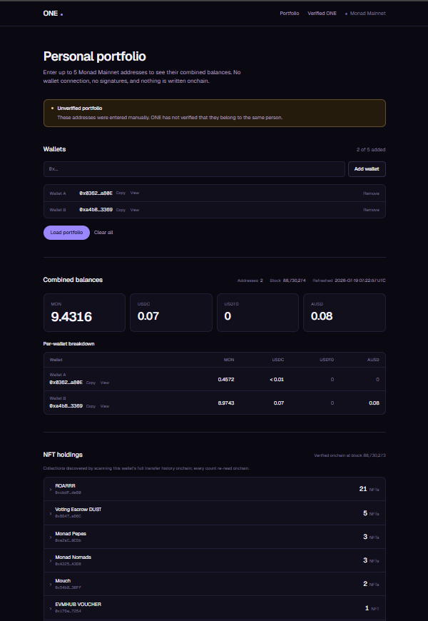

Every row expands to a per-wallet breakdown, so you can see which wallet holds what.

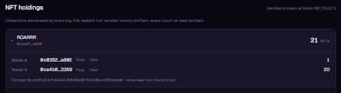

<details>
<summary>A wallet with a larger collection set</summary>

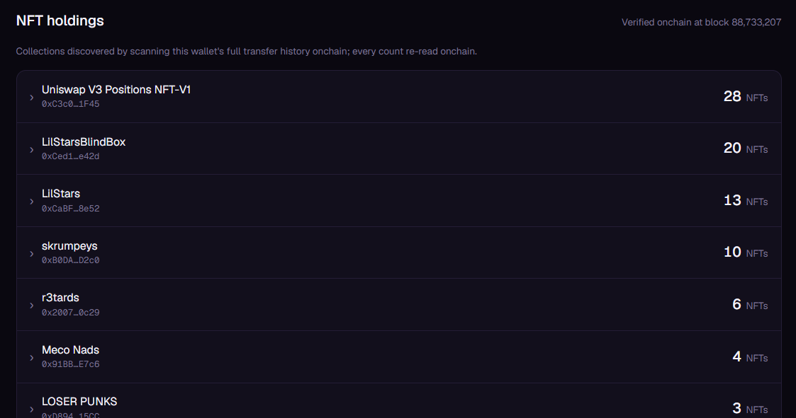

</details>

**How it works**

1. ONE scans public Monad **ERC-721 `Transfer` logs** for candidate collections.
2. Scanning runs **newest-first**, so the most relevant collections surface early.
3. Block ranges **adapt automatically** — the window halves whenever an RPC response is too large.
4. ERC-721 transfers are distinguished from ERC-20 **structurally**: ERC-721 indexes `tokenId`, giving four log topics where ERC-20 has three. No allowlist, no guesswork.
5. Every candidate is checked through **ERC-165** before being presented as ERC-721.
6. Collection **names are read from the collection contract** where available.
7. Current balances are **re-read onchain through Multicall3** at a pinned block.
8. Counts are **aggregated across all entered or linked wallets**.
9. Each row expands to a **per-wallet breakdown**.

**What it will never do**

- A failed discovery is **never** shown as zero NFTs.
- A partial scan is **clearly labelled as partial**.
- No invented collection names, counts or images.
- No paid NFT provider is currently required.

**Current limitations**

- Wide log scanning currently depends mainly on `rpc1.monad.xyz`; it is the only tested Monad endpoint that accepts sufficiently wide topic-filtered ranges.
- Highly active wallets take longer and may return a clearly labelled **partial** result rather than full history.
- **No ERC-1155 support.**
- **No automatic NFT image gallery.**

---

## Verified ONE

A Verified ONE links **two to five wallets** into one public identity.

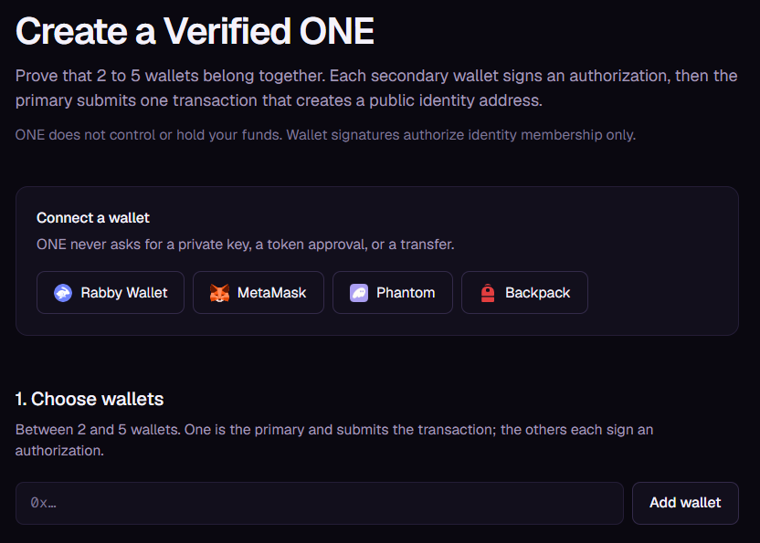

**How creation works**

- One wallet is the **primary**; the rest are **secondaries**.
- Every secondary signs an **EIP-712 `JoinOne` authorization**.
- The primary submits the final transaction and does not sign separately — submitting *is* its proof of intent.
- The signature covers the **complete wallet set**, not just the signer.
- Wallet addresses are **sorted canonically** so the signed set is unambiguous.
- **Nonces** prevent signature replay.
- **Deadlines** limit how long a signature stays valid.
- The **ONE address is predicted before submission** and shown to you.
- The transaction is **simulated** before it is sent.
- **Gas is estimated for the exact call**.
- The relationship becomes **public onchain**.

Throughout the interface these are **linked wallets**, **wallets in this ONE**, and **verified wallets**. The word *members* appears only in contract functions and implementation notes.

### Wallet support

| Where you are | How you connect |
|---|---|
| Desktop browser with an extension | **Injected wallet** — MetaMask, Rabby and anything announcing via EIP-6963, listed by its real name |
| Desktop browser with no extension | **WalletConnect QR** — scan with a wallet on your phone |
| Mobile Safari or Chrome | **Deep link** — opens your wallet app and returns you to the page |
| A wallet's in-app browser | **Injected wallet**, exactly as on desktop |

Every route into the app produces the same connection state, so signing,
network checks and transaction submission behave identically however you
arrived. Because people switch accounts while away from the browser — easy to
do on mobile — the connected account is **re-read and re-verified immediately
before every signature and transaction**, never trusted from when you connected.

**Reading needs no wallet at all.** The watch-only portfolio, the public ONE
lookup and every public profile work with no connection, no signature and no
extension. A wallet is required only to *act*: signing a `JoinOne`
authorization, creating a ONE, or removing a linked wallet — and only from the
wallet actually authorized to do it.

> Mobile connection uses [Reown/WalletConnect](https://reown.com) and needs
> `NEXT_PUBLIC_REOWN_PROJECT_ID`. Without it the app still runs: injected
> wallets and every public page keep working, and only the mobile/QR option is
> hidden.

---

## Built-in safety checks

The interface is deliberately hard to misuse. These screenshots show the guardrails doing their job.

**A wallet cannot belong to two active ONE identities.** ONE checks every candidate against the Registry and says exactly which identity already holds it.

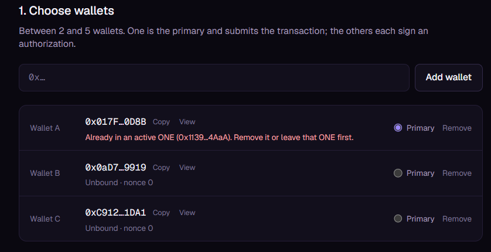

**Every secondary must sign, from the correct wallet.** ONE will not proceed on the wrong account and will not sign on any wallet's behalf.

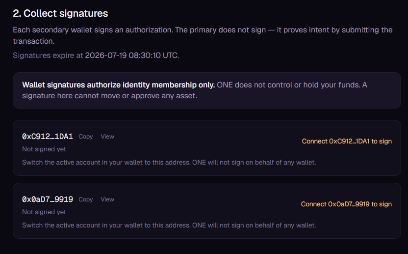

**Creation stays disabled until every condition passes.** Here the review panel refuses to submit and lists all three reasons — two unsigned wallets and one already-linked wallet — alongside the gas policy.

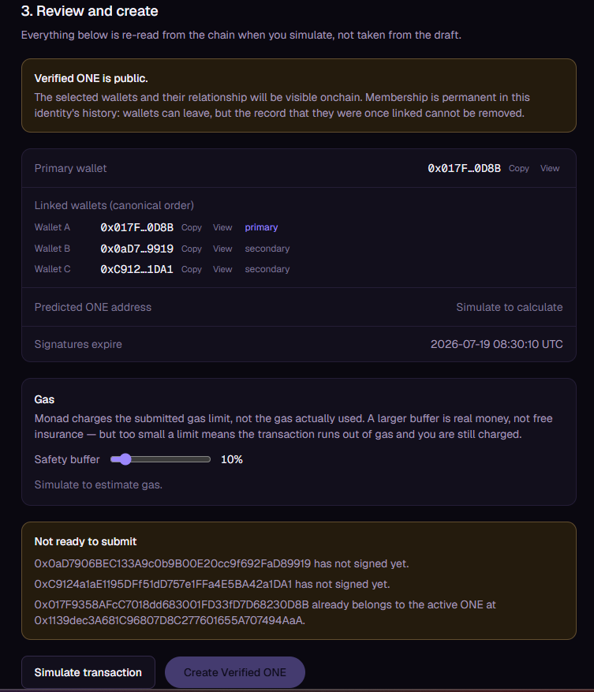

**The full set of enforced rules**

| Check | Behaviour |
|---|---|
| Duplicate identity | A wallet cannot belong to two active ONEs |
| Signatures | Every secondary must sign |
| Wallet match | The exact required wallet must be connected |
| Expiry | Signatures expire |
| Configuration change | Any change invalidates previously collected signatures |
| Nonces | Re-read from the chain immediately before creation |
| Bindings | Existing active ONE bindings re-checked before submission |
| Address integrity | Predicted and emitted ONE addresses must match, or creation is treated as failed |
| Readiness | Creation stays disabled until all conditions pass |
| Failures | RPC or contract failures are **never** silently shown as zero |
| Simulation | The exact call is simulated before submission |

**On gas.** Monad charges based on the **submitted gas limit**, not the gas actually used. ONE therefore estimates each transaction individually and applies a small, adjustable buffer rather than a blanket worst-case limit — an oversized limit is real money, not free insurance.

---

## Finding and sharing a ONE

**If you already have one.** Connect a wallet on the Verified ONE page and your
identity appears at the top of the page — address in full, your role (primary or
secondary, read from the Registry rather than inferred), and buttons to **copy
the ONE address**, **copy a public profile link**, or **view your ONE**. The
copied address is always complete even where the display shortens it, and the
profile link is built from the current browser origin, so it is correct on
localhost, on a preview deployment, and on any domain the app is later served
from.

**If you have someone else's.** The landing page has a public lookup: paste a
ONE identity address *or* any wallet currently linked to one, and it opens the
profile. No wallet, no connection, no signature — it reads public Registry data.

One asymmetry worth knowing, because it follows from the contract rather than
the interface:

| You paste | Resolves |
|---|---|
| A **ONE identity** address | Active **and** inactive historical identities |
| A **wallet** address | Only that wallet's **current active** ONE |

The Registry keeps no reverse index from a wallet to its past memberships, so an
inactive relationship cannot be found from a wallet address. A direct ONE
address always works.

Failures stay distinct: an unreachable RPC reports as an RPC problem, never as
"no ONE found".

## Public ONE profile

Share a ONE address and anyone can open its public profile.

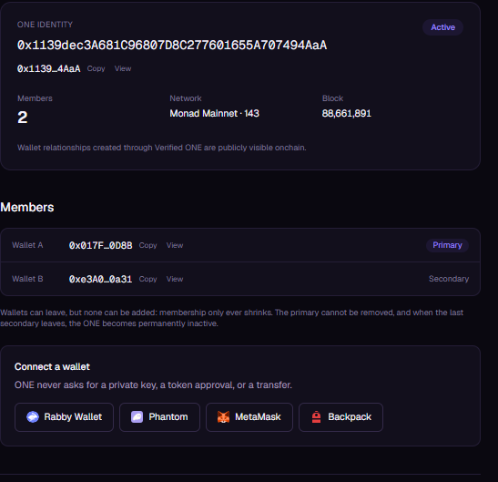

*The first live Verified ONE on Monad Mainnet — two linked wallets, one primary, active.*

A profile shows active or inactive status, the linked wallets, which is primary, combined MON, combined supported stablecoins, automatically discovered NFT collections, per-wallet balances, the network and Registry, and explorer links.

> ### Important: a ONE address is not a wallet
>
> - The ONE identity address **does not hold the assets**.
> - Assets remain in the linked wallets at all times.
> - **Do not send MON, ERC-20 tokens or NFTs to a ONE address.**
> - A normal block explorer will show the ONE contract holding **zero** — that is correct and expected.
> - The ONE app understands the contract and computes the combined view from the linked wallets.

---

## External integrations

A ONE identity is a reusable building block. Applications that could query it:

- NFT mint eligibility
- Airdrop eligibility
- Token-gated communities
- DAO dashboards
- Portfolio trackers
- Loyalty systems
- Proof of historical wallet association

**Worked example**

```
Wallet A owns 2 NFTs
Wallet B owns 1 NFT
Wallet C owns 2 NFTs

ONE combined eligibility = 5 NFTs
```

That user fails a "hold 5" gate on every wallet individually, yet genuinely qualifies.

To support this, an external application must **explicitly integrate `ONERegistry` or `ONEIdentity`** and read the linked wallets. *No third-party integrations exist today* — this describes what the contracts make possible, not shipped partnerships.

## For integrators: identity is not authentication

> **A ONE address is public. Anyone can copy it. Receiving one proves nothing.**

This is the single mistake most likely to be made when integrating ONE, so it is
worth stating bluntly: a ONE identity address is public data, published onchain
and visible on any profile page. If your application accepts a pasted ONE
address as evidence of ownership, **anyone can paste anyone else's** and inherit
their combined holdings.

ONE answers *"which wallets belong together, and what do they hold?"* It does
not answer *"is this person one of those wallets?"* That second question is
authentication, and it remains your application's job.

**For anything that grants value** — a claim, mint, allowlist, airdrop, or
token gate — do this instead:

1. **Ask the user to connect and sign.** A wallet signature, or a transaction
   sent from the wallet, is the proof. A pasted address is not.
2. **Resolve the ONE from the authenticated wallet**, never from user input:
   `ONERegistry.activeOneOf(wallet)`.
3. **Require the result to be non-zero and the ONE to be active.** An inactive
   ONE has only its historical primary left and must not carry eligibility.
4. **Check eligibility against the identity**, using
   `ONEIdentity.combinedERC721Balance(collection)` or
   `meetsERC721Threshold(collection, minimum)`.
5. **Record the claim against the ONE address**, not against each wallet.

That last point is what makes aggregation safe. A ONE can hold up to five
wallets; if you record claims per wallet, one person claims five times. Keying
on the identity — `claimed[oneAddress]` — collapses those into one.

```solidity
// Illustrative only — no audited claim contract ships with ONE.
address one = registry.activeOneOf(msg.sender);   // authenticated caller
require(one != address(0), "wallet not in a ONE");
require(registry.isActive(one), "ONE is inactive");
require(!claimed[one], "already claimed");        // keyed on identity
require(ONEIdentity(one).meetsERC721Threshold(collection, 5), "not eligible");
claimed[one] = true;
```

ONE provides **identity and aggregation**. Your application remains responsible
for **authentication and claim tracking**.

📘 **[Full integration guide →](docs/integration-guide.md)** — onchain and
offchain flows, primary-only vs any-wallet authorization, inactive handling, and
what ONE deliberately does not guarantee.

---

## Architecture

```mermaid
flowchart TD
    subgraph PP["Personal Portfolio — watch only"]
        A1["User-entered public addresses"] --> A2["Read-only Monad RPC"]
        A2 --> A3["MON, stablecoin and NFT aggregation"]
        A3 --> A4["Unverified portfolio"]
    end

    subgraph VO["Verified ONE — onchain identity"]
        B1["Secondary wallet EIP-712 signatures"] --> B2["Primary createOne transaction"]
        B2 --> B3["ONERegistry"]
        B3 --> B4["ONEIdentity"]
        B4 --> B5["Public ONE profile"]
        B5 --> B6["Third-party integrations"]
    end

    B3 -. "sole source of linked wallets" .-> B4
```

**Design rules**

- **`ONERegistry` is the sole source of membership truth.**
- **`ONEIdentity` stores only an immutable reference to the Registry.**
- `ONEIdentity` reads its linked wallets *from* the Registry on every call.
- There is **no duplicate mutable wallet list** — it is structurally impossible for the two to disagree.
- There is **no upgradeable proxy**. Contracts are deployed directly and are not upgradeable.
- There is **no custody**. Neither contract can move a user's assets.
- `ONEIdentity` contracts are deployed **through the Registry**, never by hand.

---

## Contract lifecycle

| Rule | Detail |
|---|---|
| Size | Two to five wallets |
| Primary | Exactly one, chosen at creation |
| Exclusivity | One active ONE per wallet |
| Additions | **No wallets can be added after creation** |
| Secondary exit | A secondary may remove itself |
| Primary action | The primary may remove a secondary |
| Primary exit | The primary **cannot** remove itself directly |
| Replacement | Removed slots cannot be refilled |
| Deactivation | When only the primary remains, the ONE becomes **inactive** |
| History | The historical ONE remains permanently queryable |
| Reuse | An unbound wallet may later join another ONE |
| Permanence | Historical relationships remain public |

Membership only ever shrinks. The primary leaves by removing every secondary, which deactivates the identity and frees all wallets — including its own.

---

## Mainnet deployment

| | |
|---|---|
| Network | Monad Mainnet |
| Chain ID | `143` |
| Registry | [`0xf8E62d8D16acB49eeEeCF13DE48f1f6898c2F915`](https://monadscan.com/address/0xf8E62d8D16acB49eeEeCF13DE48f1f6898c2F915) |
| Registry deployment tx | [`0x317153a9…932f2`](https://monadscan.com/tx/0x317153a9131d77d77f65714d70b98caf212f49f8ca6e031c5f8eed461ac932f2) |
| First live Verified ONE | [`0x1139dec3A681C96807D8C277601655A707494AaA`](https://monadscan.com/address/0x1139dec3A681C96807D8C277601655A707494AaA) |
| First ONE creation tx | [`0xd329c3ee…ff8b6`](https://monadscan.com/tx/0xd329c3ee3fe741f1abf3e9cc53fc488b3f8f4db989df28922209ee0d307ff8b6) |

**Build and verification**

- Source verified through **Sourcify / MonadVision** with an **exact match** on both creation and runtime bytecode.
- **Solidity 0.8.28**
- **EVM version: `shanghai`**
- **OpenZeppelin 5.1.0**
- Optimizer enabled, 200 runs, no `via_ir`

Explorers: [MonadVision](https://monadvision.com/address/0xf8E62d8D16acB49eeEeCF13DE48f1f6898c2F915) · [Monadscan](https://monadscan.com/address/0xf8E62d8D16acB49eeEeCF13DE48f1f6898c2F915)

---

## Supported assets

| Asset | Support |
|---|---|
| **MON** | Native balance, combined and per-wallet |
| **USDC** | `0x754704Bc059F8C67012fEd69BC8A327a5aafb603` |
| **USDT0** | `0xe7cd86e13AC4309349F30B3435a9d337750fC82D` |
| **AUSD** | `0x00000000eFE302BEAA2b3e6e1b18d08D69a9012a` |
| **ERC-721** | Automatic collection discovery, onchain balance verification, manual collection checker |

ERC-1155 is **not** supported.

---

## Local development

**Requirements:** Node.js 20.9+, [Foundry](https://book.getfoundry.sh/getting-started/installation), Git.

### Contracts

```bash
cd contracts

forge build                 # compile
forge test                  # run the contract test suite
forge test --gas-report     # with gas reporting
forge fmt --check           # formatting check
```

### Frontend

```bash
cd app

npm install                 # install dependencies
npm run dev                 # start the local app on http://localhost:3000
npm run lint                # lint
npm run typecheck           # TypeScript
npm run test                # frontend test suite
npm run build               # production build
```

### Keeping the ABI in sync

The app's contract ABI is generated from the compiled Foundry artifacts, never written by hand:

```bash
cd contracts
forge build
node script/generate-app-abi.mjs           # regenerate
node script/generate-app-abi.mjs --check   # fail if the app has drifted
```

### Configuration

Copy `app/.env.example` to `app/.env.local`. **Every required value is public** — there are no secrets needed to run ONE.

```bash
# Public, non-secret configuration
NEXT_PUBLIC_MONAD_CHAIN_ID=143
NEXT_PUBLIC_MONAD_RPC_URL=https://rpc.monad.xyz
NEXT_PUBLIC_MONAD_FALLBACK_RPC_URL=https://rpc3.monad.xyz
NEXT_PUBLIC_ONE_REGISTRY_ADDRESS=0xf8E62d8D16acB49eeEeCF13DE48f1f6898c2F915

# NFT discovery provider. Default is the self-indexed onchain log scan.
# NFT_DISCOVERY_PROVIDER=onchain

# OPTIONAL premium provider. Not required — the default needs no credential.
# The Monad Mainnet account endpoints require a paid plan.
# BLOCKVISION_API_KEY=<your-key-here>
```

> `BLOCKVISION_API_KEY` is **server-side only**. It has no `NEXT_PUBLIC_` prefix, so it is never bundled into browser JavaScript. Never commit a real key; `app/.env.local` is gitignored.

---

## Tests

| Suite | Count |
|---|---|
| Frontend (Vitest) | **448** |
| Contracts (Foundry) | **63** |
| **Total** | **511** |

```bash
cd app && npm run test          # 448 passing
cd contracts && forge test      # 63 passing
```

Coverage includes EIP-712 typed-data construction verified against the deployed contract, `membersHash` parity with Solidity, signature invalidation rules, gas-limit policy, event parsing, prediction/event mismatch handling, custom-error decoding, NFT discovery and partial-failure handling, and the full contract lifecycle.

---

## Current limitations

- Maximum **five wallets** per ONE.
- Verified wallet relationships are **public and permanent** — that is the point, but it is a real privacy tradeoff.
- Existing ONE identities **cannot add wallets**.
- **ONE is not a wallet** and cannot safely receive funds.
- Automatic NFT discovery may take **several seconds**.
- Wide NFT log scanning depends mainly on **one RPC endpoint**.
- Highly active wallets may return a **partial** NFT discovery result.
- **No ERC-1155.**
- **No NFT image gallery.**
- **No EIP-1271** smart-contract wallet support — smart-contract wallets cannot currently sign.
- **No privacy or zero-knowledge mode.**
- **No compromised-fund recovery.**
- Proof of prior control **does not prove current control**.
- External applications must **integrate ONE explicitly**; nothing works automatically.

---

## Roadmap

None of the following exists yet.

- A new Registry version supporting up to **ten wallets**
- Better **multi-device signing**
- **Additional NFT discovery providers** for redundancy
- **Safe caching**, once provider terms are clarified
- **ERC-1155** support
- An optional **privacy-preserving** identity design
- A **third-party SDK** for integrators
- **Smart-contract wallet** support via EIP-1271
- Better **compromised-wallet provenance** tooling
- Improved **NFT metadata and image** support

---

## Repository layout

```
one/
├── contracts/          Foundry project — ONERegistry, ONEIdentity, tests, deploy scripts
├── app/                Next.js App Router frontend
├── spikes/             Research spikes, including the Monad Mainnet data investigation
└── docs/               Deployment runbook and screenshots
```

Key documents:

- [`docs/integration-guide.md`](docs/integration-guide.md) — building on ONE safely, including why a pasted ONE address must never be trusted
- [`docs/MAINNET_DEPLOYMENT.md`](docs/MAINNET_DEPLOYMENT.md) — deployment runbook and record
- [`spikes/mainnet-data/results/REPORT.md`](spikes/mainnet-data/results/REPORT.md) — the data-infrastructure investigation behind the NFT design

---

## Security

- ONE **never** asks for a private key, seed phrase, token approval or asset transfer.
- Wallet signatures authorize **identity membership only** — an EIP-712 `JoinOne` signature cannot move or approve any asset.
- Contracts are **not upgradeable** and have **no owner, admin or pause**.
- The deployer holds **no privileges** after deployment.
- A failed read is **never** displayed as a zero balance.

---

## License

MIT
